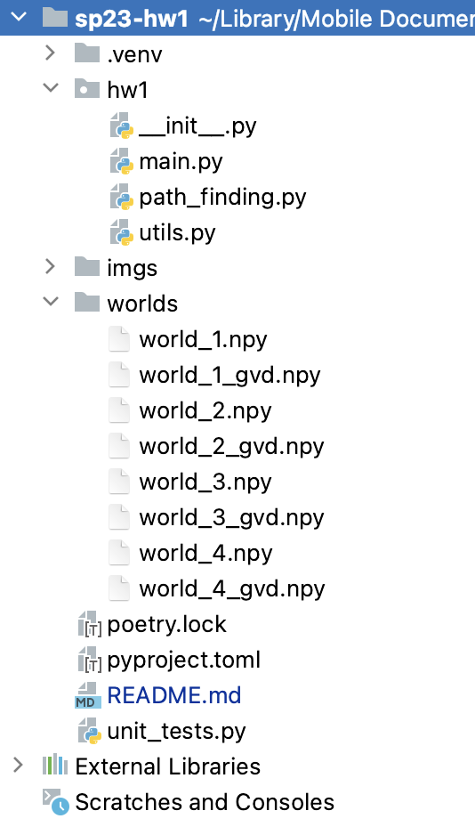
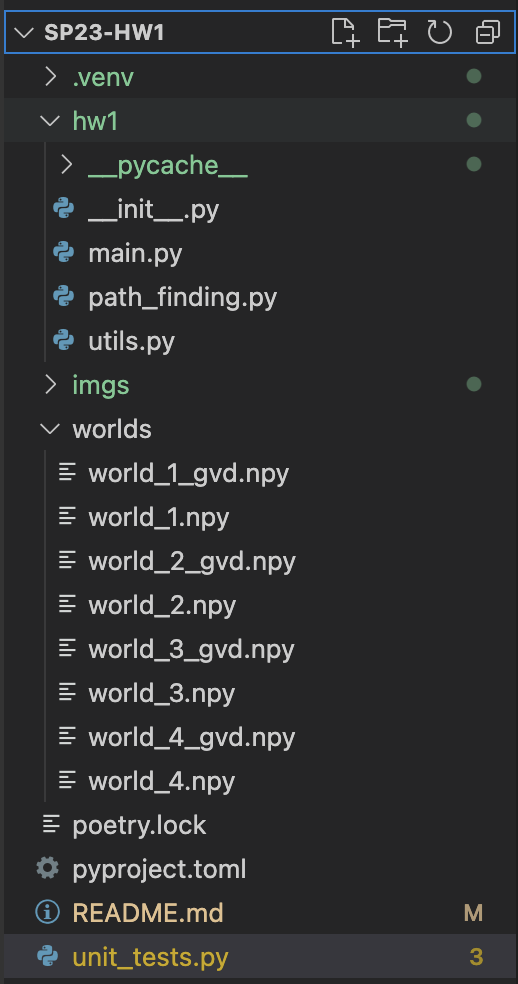
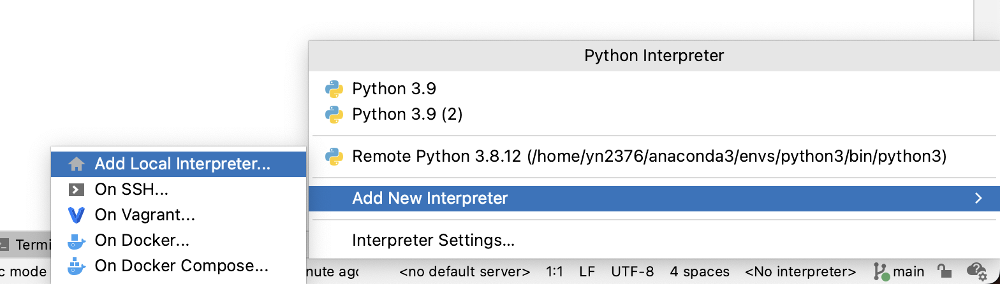
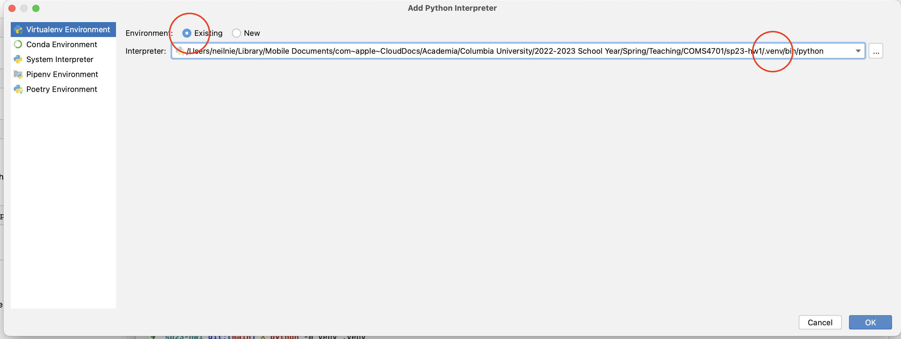
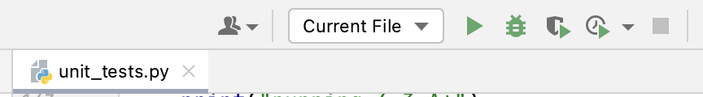
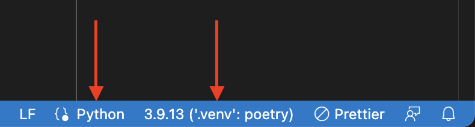
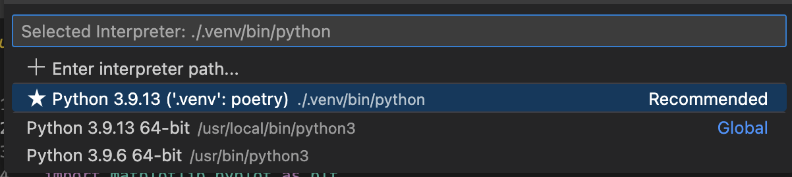
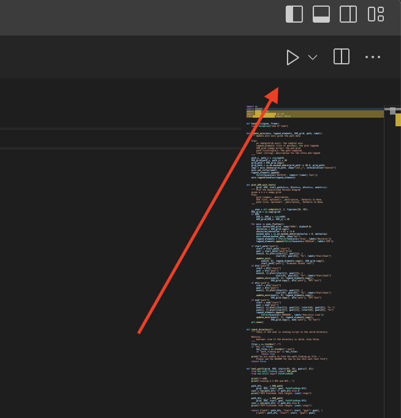
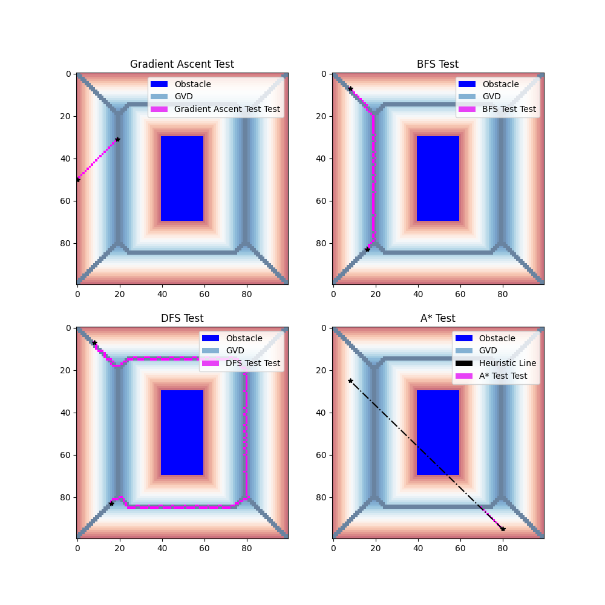

# COMS 4701 HW 1 Programming

Assignment overview:
Grid world path planning using search algorithms. 

## Install / Run Instructions

Create and activate a virtual environment for the project (at the project root directory):

```
python -m venv .venv
```

To enter the enviroment, please run the following if you are using a Mac

```
source .venv/bin/activate
```

If you are using Windows, please run

```
.venv\scripts\activate.bat
```

Install poetry in your virtual environment.

```
pip install poetry
```

Install all project dependencies

```
poetry install
```

This will set up the packages needed for the homework.

You can now modify files in `hw1/` and run the program at the root directory of the project via

```
poetry run main [directory of the grid world .npy files]
```

## How to Unit Test

### Step 1

Follow the steps above to setup your environment. Make sure all of your dependencies
have been installed properly. 

Make sure the file `unit_testing.py` is in your HW project folder. You can download the repo again or use `git`.

### Step 2

Download a good editor or IDE. We highly recommend PyCharm or VSCode. 
[[PyCharm Download]](https://www.jetbrains.com/pycharm/download/)
[[VSCode Download]](https://code.visualstudio.com/download)

We DO NOT recommend Spyder. 

You should setup your IDE and open the folder of your HW1 project. The directories should look something like this:

PyCharm: 




VSCode: 



**DO NOT proceed if your directory structure doesn't look like the screenshots above.** 

Double-check the following:
- there's a `hw1` directory that contains the `path_finding.py` script, and utility scripts.
- there's a `worlds` directory that contains the worlds numpy files. 
- there's a `.venv` directory that contains your python virtual environment. 

### Step 3: Unit Testing

You should put all of your implementation in `path_finding.py`. Once you are ready to unit test one or multiple methods, run the `unit_tests.py` script as the following:

**Terminal**:
You can type in

	>> python unit_tests.py

**Using the command line (terminal) is the easiest way to test your code. If you would like to use PyCharm or VSCode for bebugging, please follow the rest of the guide.** 


**PyCharm**:

Click on the Interpreter button in the bottom right corner of your screen. 
Select Add New Interpreter --> Add Local Interpreter



Next, choose Virtualenv Environment --> Existing --> the virtual environment you created for HW1. 



Next, open the `unit_testing.py` file. In the top right corner, press the play button to run your code. Make sure the words "Current File" are displayed. 



**VSCode**

First, find the interpreter button in the bottom right corner, and select the interpreter. Make sure the language is set to Python. 



NOTE: VS Code might have already recognized your virtual environment and automatically selected the interpreter. If 
you see the virtual environment name that you created for HW1, you are done with the setup process. 



Once you click on the interpreter button, a menu will show up at the top, find and select the virtual environment. 



Press the play button in the top right corner to run your code. 

### Step 4 Interpreting Results

Your unit testing results should look **similar** but not exactly like the following. The script will test BFS, DFS, gradient ascent, and A* separately. 
Recall that DFS is NOT guaranteed to return the optimal path. 


